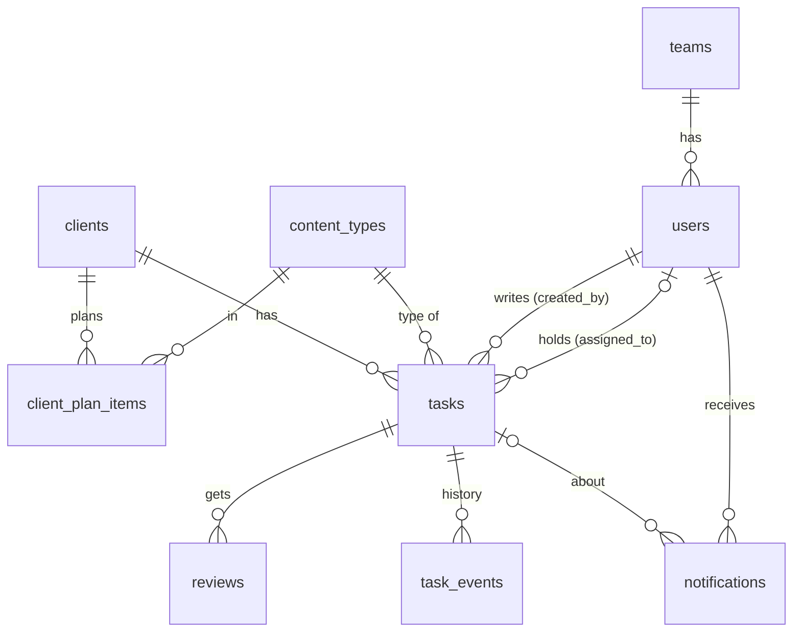

# Database

The tables the FastAPI backend needs, in one place. `api-contract.md` says what the API
answers; this says what is stored.

How to read it:

- **Columns and rules** come from the dummy API (`src/features/*/api/dummy*.ts`), which is the
  reference implementation, and from `api-contract.md`.
- Lines marked **(decide)** are choices the dummy cannot make for the backend: column types,
  constraints, indexes, delete behaviour. They are recommendations. Change them if you disagree,
  but change them *here*, so this file stays the one place.
- Names are `snake_case`, ids are integers (`GENERATED ... AS IDENTITY`), and every timestamp is
  `timestamptz` stored in UTC. The API answers ISO 8601 with `Z`. A **month** is the string
  `"YYYY-MM"`, and a month starts and ends in IST (see `api-contract.md`, Conventions).
- Enums (**decide**): use `varchar` plus a `CHECK` (in SQLAlchemy: `Enum(..., native_enum=False)`).
  A native Postgres enum is harder to change in a migration, and statuses have already changed once.

## The tables at a glance

## `teams`

Seed data for now. There is no screen to change the flags (`PATCH /teams/{id}/permissions` comes later).

| column | type | rules |
|---|---|---|
| `id` | int PK | |
| `name` | varchar(60) | unique (**decide**) |
| `can_manage_clients` | bool | default false |
| `can_create_content` | bool | default false |
| `can_assign` | bool | default false |
| `can_review` | bool | default false |
| `can_receive_tasks` | bool | default false. True for the team whose members can be given cards. |

Seed (the migration or the seed script inserts these; the app never creates teams):

| id | name | manage_clients | create_content | assign | review | receive_tasks |
|---|---|---|---|---|---|---|
| 1 | Marketing | true | true | true | true | false |
| 2 | Design | false | false | false | false | true |

An **admin has no team** and every permission. Permissions are never stored on the user.

## `users`

| column | type | rules |
|---|---|---|
| `id` | int PK | |
| `name` | varchar(80) | required |
| `email` | varchar(254) | stored **lower-cased, with the dots the admin typed** |
| `email_key` | varchar(254) | **unique** (**decide**). The email as compared: lower-cased, and for `gmail.com` without dots and without a `+tag`. Two people can never differ only by dots. |
| `role` | `admin` \| `member` | |
| `team_id` | int FK `teams`, nullable | `null` exactly when `role = admin`. A member must have a team. (`CHECK`, **decide**) |
| `google_picture_url` | varchar(500), nullable | the photo Google reported at the last sign-in |
| `avatar_key` | varchar(100), nullable | the person's own uploaded picture (a file name or storage key); `null` = none. `avatar_url` is their upload if there is one, else `google_picture_url`. |
| `is_active` | bool | default true. Inactive people cannot sign in and every endpoint refuses them at once. |
| `created_at` | timestamptz | |

- There must always be at least one active admin. Nobody changes their own role or email, or
  deactivates themselves. These are checked in the API, not in the database.
- People are never deleted, only deactivated. Their cards, reviews and history keep pointing at them.
- The first admin is inserted by a seed script run once by the developer (not by the app).

## `content_types`

| column | type | rules |
|---|---|---|
| `id` | int PK | |
| `name` | varchar(40) | trimmed, inner spaces collapsed. **Unique ignoring case** (`unique index on lower(name)`), so `Poster` and `poster` can never both exist. |
| `is_active` | bool | default true |

- Never deleted: old cards and plans keep their type.
- A type that is turned off cannot be added to a plan, but plans and cards that already use it keep working.
- Renaming a type renames the cards the app named after it, in the same transaction (see `tasks.title`).
- Seed: Poster, Reel, Story, Carousel, Video, 3D.

## `clients`

| column | type | rules |
|---|---|---|
| `id` | int PK | |
| `name` | varchar(100) | trimmed. **Unique ignoring case, archived clients included** (`unique index on lower(name)`): reusing a name would make old reports ambiguous. |
| `notes` | varchar(500), nullable | empty becomes `null` |
| `is_archived` | bool | default false |

Never deleted, only archived, so old reports keep their numbers.

## `client_plan_items`

History rows, never one editable number per client. The full rules (how the plan in force for a
month is derived, and how a save replaces rows) are in `api-contract.md`, *Plan history*.

| column | type | rules |
|---|---|---|
| `client_id` | int FK `clients` | |
| `content_type_id` | int FK `content_types` | |
| `effective_from_month` | char(7) | `"YYYY-MM"`; a change may only start this month or later |
| `count` | int | `0` means the type **ends** from that month; otherwise 1 to 999 |
| `created_by` | int FK `users` | in the contract; the dummy does not keep it |
| `created_at` | timestamptz | in the contract; the dummy does not keep it |

Primary key (or unique): `(client_id, content_type_id, effective_from_month)`.
Index (**decide**): `(client_id, effective_from_month)`.

## `tasks`

A content card and a board task are the same row.

| column | type | rules |
|---|---|---|
| `id` | int PK | never reused |
| `client_id` | int FK `clients` | an active client when the card is created |
| `content_type_id` | int FK `content_types` | must be in the client's plan for `month` |
| `month` | char(7) | `"YYYY-MM"`: the month the card is **for**, not when it was written. Not in the past when created; at most 24 months ahead. |
| `title` | varchar(120) | the card's name. The app names it `<type name> <n>` ("Poster 3"); a title someone typed is kept as typed. Not unique. |
| `content` | varchar(5000) | default `''`. What the post says. |
| `notes` | varchar(2000) | default `''`. Instructions for the designer. |
| `status` | `todo` \| `ongoing` \| `submitted` \| `fix` \| `done` | default `todo` |
| `created_by_id` | int FK `users` | |
| `assigned_to_id` | int FK `users`, nullable | `null` = no designer yet. **Not a status.** Must be an active user whose team has `can_receive_tasks`. |
| `file_link` | varchar(500), nullable | the finished design; an `http(s)` link, set when the designer submits |
| `posting_date` | date, nullable | |
| `deadline` | date, nullable | not after `posting_date` when both are set. A new or changed deadline may not be in the past (IST). |
| `created_at` | timestamptz | |
| `updated_at` | timestamptz | the card's **version**: changes on every write and always gets strictly later (see below) |

Rules the database can hold (**decide**, as `CHECK`s):

- `status <> 'todo'` implies `assigned_to_id IS NOT NULL`: a card nobody holds cannot be started.
- `deadline <= posting_date` when both are not null.

Indexes (**decide**), from the queries the app makes:

- `(month, client_id)`: the content calendar and the board load one month, often for one client.
- `(assigned_to_id, status)`: a designer's cards, and "what is on their plate".
- `(status)` with `month`: `include_late=true` loads earlier months' cards that are not `done`.

**`updated_at` as a version.** Two people editing or moving the same card must never overwrite each
other: `PATCH /tasks/{id}` and `PATCH /tasks/{id}/status` both send the `updated_at` they saw and
get `409` if it has changed. So two writes must never leave the same value, even within one
millisecond. (**Decide:** set it from `clock_timestamp()` and, if that is not later than the old
value, use the old value plus 1 microsecond; and serialise it with microsecond precision. Or keep
a separate integer `version` and let `updated_at` be informational. Whatever you choose, the API
must keep answering and accepting one opaque string called `updated_at`.)

**Deleting.** A card can only be deleted while it is `todo`. Then its `reviews` and `task_events`
go with it (`ON DELETE CASCADE`, **decide**) and its `notifications` stay with `task_id = NULL`.

## `reviews`

A reviewer's decision on a submitted design.

| column | type | rules |
|---|---|---|
| `id` | int PK | |
| `task_id` | int FK `tasks` | `ON DELETE CASCADE` (**decide**) |
| `reviewer_id` | int FK `users` | |
| `decision` | `approved` \| `rejected` | |
| `comment` | varchar(1000), nullable | **required** when `rejected` (what to fix); optional when `approved` |
| `created_at` | timestamptz | |

`latest_review` in the API is the last row of the card by `created_at`, then `id`. It is written in
the same transaction as the status change that causes it.

## `task_events`

The history the daily report counts. One row each time a card is created, given a designer, loses
its designer, or changes status. Details in `api-contract.md`, *Status history*.

| column | type | rules |
|---|---|---|
| `id` | int PK | |
| `task_id` | int FK `tasks` | `ON DELETE CASCADE` (**decide**) |
| `kind` | `status` \| `assigned` \| `unassigned` | |
| `from_status` | status, nullable | `null` on the first row (creation) |
| `to_status` | status | equals `from_status` on `assigned` and `unassigned` rows |
| `actor_id` | int FK `users` | who did it |
| `created_at` | timestamptz | |

Indexes: `(created_at)` and `(task_id)`. Written in the same transaction as the change.

## `notifications`

Columns, the index and the "who is told what" table are in `api-contract.md`, *Notifications*.
In short: `id`, `user_id` (FK), `type`, `task_id` (FK, `ON DELETE SET NULL`), `message` (written
by the backend when it happens and stored), `is_read`, `created_at`; index
`(user_id, is_read, created_at)`.

## Not stored: the backend works these out

Never keep a counter that a query can give. Storing one is how reports start to disagree with the board.

- The month overview (`written`, `to_write`, `extra`, `done`, `delivery_remaining`, `to_design`,
  `unassigned`) is counted from `tasks` and the plan in force. See *Month overview* in the contract.
- Every number in `GET /reports/summary` (status counts, `unassigned`, activity, overdue, late) is
  counted from `tasks` and `task_events`.
- "Late" (a card of an earlier month that is not done) and "overdue" (a deadline before today in IST)
  are computed from `month`, `deadline` and `status`.
- `current_plan` of a client is derived from `client_plan_items`.

## Not in the dummy, still to decide with the backend

- **Sessions.** The contract says an httpOnly cookie session and a refresh cookie. Whether that is a
  signed token or a `sessions` table, lifetimes, rotation and revocation when someone is deactivated
  are decided with the auth code.
- **`audit_log`** (who changed what): planned for later, not needed for the demo.
- **Migrations.** One Alembic revision per step; the first revision creates the tables above and
  seeds `teams` and `content_types`.
